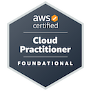

# 👋 Oi, bem-vindo ao meu GitHub!  
Sou **Lucas M. Laranja**, apaixonado por tecnologia, automação e segurança 🤖

  

---

🎓 **Último período de Engenharia da Computação**  
🔐 **Analista DevOps na Sysmanager atuando no Grupo Globo**  
☁️ **AWS Certified Cloud Practitioner (CLF-C02)**  

---

### 🏅 Certificações

**AWS Certified Cloud Practitioner (CLF-C02)**  
Emitido por **Amazon Web Services (AWS)**  
[🔗 Verificar Credencial na Credly](https://www.credly.com/badges/a6fe4afb-c3ea-45cb-8b93-094a155de431/public_url)

---

###  Tecnologias que utilizo

  
  
  
  
  
  
  

  
---

###  Projetos em destaque
- [🧪 CI/CD com FastAPI + GitHub Actions + ArgoCD](https://github.com/LucasLaranja/app-projeto) → *Pipeline automatizado com deploy em Kubernetes*  
- [📦 Repositório GitOps com manifests Kubernetes](https://github.com/LucasLaranja/hello-manifests) → *Estratégia declarativa de entrega contínua*  
- [Projeto WordPress](https://github.com/LucasLaranja/ProjetoWordPress) → *Deploy de aplicação WordPress na AWS utilizando EC2, RDS, EFS e Load Balancer. Configuração automatizada com scripts e versionamento via Git.*  

---

###  Estatísticas

  

---

💡 Estudante de Engenharia da Computação focado em construir soluções seguras e escaláveis com tecnologia de ponta. Sempre buscando aprender, inovar e contribuir!
